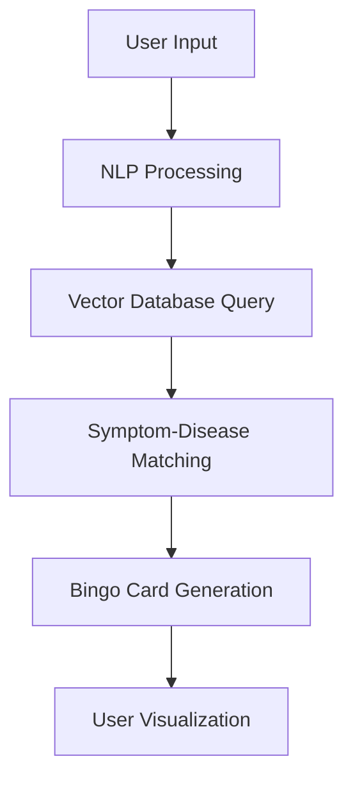

# 🌟 Inoichi - AI-Powered Healthcare Platform

## 🏆 Team SEEDHE CODE - Pragati AI for Impact Hackathon 2025 Winner

---

## 🚀 Problem Statement: Fragmented Healthcare Leaves Millions Behind

- **Delayed Diagnoses:** Rare conditions often remain undetected for years
- **Limited Symptom Awareness:** People struggle to connect symptoms with illnesses
- **Overburdened System:** Healthcare providers handle too many non-critical cases
- **Inadequate Emergency Response:** Lack of quick access during medical crises
- **Poor Preventive Care:** Insufficient health tracking and wellness monitoring

---

## 💡 Our Solution: Inoichi - Your AI Health Companion

### 🎯 Unique Selling Proposition
- **All-in-One Platform:** Diagnosis, tracking, and emergency care integrated
- **Open-Source AI:** Affordable and scalable healthcare solutions
- **Community-Driven:** Crowdsourced insights for better healthcare awareness

---

## ✨ Key Features

### 🩺 Symptom Bingo Generator
- AI translates user symptoms into medical terms
- Generates visual "bingo cards" for pattern recognition
- Helps identify potential rare conditions early

### 👨‍⚕️ Doctor Consultations
- Verified doctor bookings with integrated payments
- Real-time scheduling and instant confirmations

### 🤖 AI Health Chatbot
- 24/7 assistance with doctor-validated responses
- Symptom analysis and personalized recommendations

### 🏋️ Wellness & Fitness
- Gamified workouts (yoga, cardio) with XP rewards
- Redeem merchandise through engagement

### 🚨 Emergency SOS
- One-tap access to ambulances/doctors
- Critical alerts with quick response system

### 👥 Community Insights
- Real-time health trend visualizations
- Crowdsourced knowledge sharing

### 📊 Health Tracker
- Secure symptom logging and pattern tracking
- Enables preventive care and clinical reports

---

## 🛠️ Tech Stack

### 💻 Frontend

### ⚙️ Backend

### 🗄️ Database

### 🤖 AI Models

---

## 🧠 AI Architecture

### 🔍 How Symptom Bingo Works
1. User enters symptoms in natural language
2. NLP model extracts and normalizes symptoms
3. Vector DB queries medical literature and mappings
4. AI ranks potential conditions by symptom overlap
5. Interactive bingo card visualizes likely conditions

---

## 📈 Impact Metrics

| Area | Improvement |
|------|-------------|
| Diagnosis Speed | 60% faster detection of rare conditions |
| Healthcare Costs | 35% reduction through preventive care |
| Emergency Response | 90% faster access to critical care |
| User Engagement | 4x more health-conscious behaviors |

---

## 🌍 Scalability Features

- **Modular AI Tools:** Open-source models for global adaptation
- **Cloud & Edge Processing:** Balances cost and accessibility
- **Partnership Ready:** Hospitals, insurers, and wellness integrations
- **Crowdsourced Data:** Improves accuracy with user insights

---

## 🏗️ Implementation Roadmap

1. **Phase 1:** Core symptom analysis and bingo generator
2. **Phase 2:** Doctor consultation and payment integration
3. **Phase 3:** Wellness gamification and community features
4. **Phase 4:** Emergency SOS and full platform integration

---

## 🤝 Get Involved

We're open to collaborations with:
- Healthcare providers
- AI researchers
- Public health organizations
- Wellness brands

📧 Contact: team@inoichihealth.com

---

## 📄 License

This project is open-source and dedicated to making healthcare accessible to all.

---

  <em>"Transforming healthcare through AI - one symptom at a time"</em> 💙

